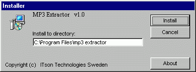

## Setup program III

### Description

UPDATED (ver 1.3)! If you have done a program you maybe want to make your own Installer program for it. Here it is. Your own Installer program with compression. You can make the Installer just like you want. Or if you want to make a Setup program like Wise Install or Install-us. Make one yourself.

New in this version (1.3) is a working Install directory. It will add shortcuts to your program. And a much better interface.

Please VOTE if you like the program.

Do you want to make more money while you programming? Goto: http://www.paidforsurf.com/index.asp?refid=rompa

and get paid.
 
### More Info
 

             |
---                |---
**Submitted On**   |2000-08-28 12:34:38
**By**             |[Ronnie Staxborn](https://github.com/Planet-Source-Code/PSCIndex/blob/master/ByAuthor/ronnie-staxborn.md)
**Level**          |Intermediate
**User Rating**    |4.8 (186 globes from 39 users)
**Compatibility**  |VB 5\.0, VB 6\.0
**Category**       |[Complete Applications](https://github.com/Planet-Source-Code/PSCIndex/blob/master/ByCategory/complete-applications__1-27.md)
**World**          |[Visual Basic](https://github.com/Planet-Source-Code/PSCIndex/blob/master/ByWorld/visual-basic.md)
**Archive File**   |[CODE\_UPLOAD93648282000\.zip](https://github.com/Planet-Source-Code/ronnie-staxborn-setup-program-iii__1-9662/archive/master.zip)

